<p align="center">
  
</p>

<h1 align="center">🔬 Tumor Ablation Zone Prediction System</h1>

<p align="center">
  <strong>An AI/ML-driven Clinical Decision Support Tool for Microwave Ablation Treatment Planning</strong>
</p>

<p align="center">
  
  
  
  
  
  
</p>

<p align="center">
  
  
  
  
  
</p>

<p align="center">
  <strong>Bachelor of Technology (Honours) Project</strong> · IIIT Kottayam · April 2026<br/>
  <strong>Author:</strong> Rishi Sharma (Roll No. 2023BCD0023)
</p>

---

## 📋 Table of Contents

- [Overview](#-overview)
- [Problem Statement](#-problem-statement)
- [Key Features](#-key-features)
- [System Architecture](#-system-architecture)
- [Dataset](#-dataset)
- [Exploratory Data Analysis](#-exploratory-data-analysis)
- [Feature Engineering](#-feature-engineering)
- [Model Training & Results](#-model-training--results)
- [Production-Ready Full-Stack Architecture](#-production-ready-full-stack-architecture)
- [Project Structure](#-project-structure)
- [Getting Started](#-getting-started)
- [Sample Predictions](#-sample-predictions)
- [Limitations & Future Work](#-limitations--future-work)
- [Academic Context](#-academic-context)
- [License](#-license)

---

## 🧬 Overview

Cancer remains one of the leading causes of morbidity globally. **Microwave Ablation (MWA)** has emerged as a promising minimally invasive technique for treating solid tumors in organs such as the liver, lung, kidney, and adrenal glands. MWA works by delivering electromagnetic energy through interstitial antennas to heat and destroy cancerous tissue, creating a region of necrosis known as the **ablation zone**.

This project develops an **end-to-end machine learning system** and **full-stack web application** that predicts the ablation zone dimensions (effective diameter and length) from treatment parameters — replacing hours of physics-based simulations with **millisecond-level ML predictions**.

> **🏆 Key Achievement:** Random Forest model explains ~70% of variance in ablation diameter with an average prediction error of only **6.02 mm** — within the range of measurement uncertainty in published clinical studies.

---

## 🎯 Problem Statement

> *Develop an AI/ML-based predictive model that accurately estimates the ablation zone produced during tumor treatment using microwave ablation parameters, enabling faster and more accurate treatment planning while minimizing damage to surrounding healthy tissues.*

**The central challenge:** Predicting the dimensions of the ablation zone (diameter, length, volume) from treatment parameters (input power, duration, antenna type) without requiring computationally expensive physics-based simulations (FEM/FDTD).

### Research Gap Addressed

| Existing Approach | Limitation |
|:---|:---|
| Physics-based simulations (FEM/FDTD) | Computationally expensive — hours per case |
| Manufacturer lookup tables | Limited to specific antenna–power–time combos |
| Empirical formulas | Poor generalization across antenna designs |
| **This Project (ML-based)** | **✅ Generalizes across 15+ antenna types, runs in ms** |

---

## ✨ Key Features

| Feature | Description |
|:---|:---|
| 🤖 **6 ML Models Compared** | Ridge, KNN, SVR, Random Forest, Gradient Boosting, MLP |
| 📊 **Comprehensive EDA** | 12+ publication-quality plots with detailed statistical analysis |
| 🔧 **Advanced Feature Engineering** | Energy-based, log-transformed, and interaction features |
| 🏥 **Full-Stack Application** | React SPA cleanly decoupled from an asynchronous FastAPI backend |
| 🛡️ **Production SDE Patterns** | Dockerized deployment, Prometheus metrics, Redis-backed rate limiting |
| 📈 **GridSearchCV Tuning** | 10-fold cross-validation with exhaustive hyperparameter search |
| 🧪 **Dual Data Sources** | 222 experimental + 104 simulated samples from 30+ papers |
| 📄 **Full Deployable System** | Scalable database abstraction (`asyncpg` + SQLAlchemy) and Pydantic validation |
| 🔍 **Algorithmic Transparency** | Dashboard exposes model metadata and confidence metrics |

---

## 🏗 System Architecture

```
┌────────────────────────────────────────────────────────────────────┐
│                    ABLATION ZONE PREDICTION SYSTEM                 │
├────────────────────────────────────────────────────────────────────┤
│                                                                    │
│  ┌──────────────────────┐    ┌──────────────────────────────────┐  │
│  │   ML PIPELINE        │    │   FULL-STACK APPLICATION         │  │
│  │                      │    │                                  │  │
│  │  ┌────────────────┐  │    │  ┌────────────┐ ┌────────────┐  │  │
│  │  │ Data Collection│  │    │  │  React +   │ │  FastAPI   │  │  │
│  │  │ (30+ papers)   │  │    │  │  Vite SPA  │ │  Backend   │  │  │
│  │  └───────┬────────┘  │    │  │            │ │            │  │  │
│  │          ▼           │    │  │ • Input    │ │ • REST API │  │  │
│  │  ┌────────────────┐  │    │  │   Form     │ │ • Model    │  │  │
│  │  │ Feature        │  │    │  │ • KPI      │ │   Loader   │  │  │
│  │  │ Engineering    │  │    │  │   Cards    │ │ • Pydantic │  │  │
│  │  └───────┬────────┘  │    │  │ • Model    │ │   Valid.   │  │  │
│  │          ▼           │    │  │   Info     │ │ • CORS     │  │  │
│  │  ┌────────────────┐  │    │  └──────┬─────┘ └─────┬──────┘  │  │
│  │  │ Preprocessing  │  │    │         │    HTTP      │         │  │
│  │  │ & Scaling      │  │    │         └──────────────┘         │  │
│  │  └───────┬────────┘  │    │                                  │  │
│  │          ▼           │    └──────────────────────────────────┘  │
│  │  ┌────────────────┐  │                                         │
│  │  │ Model Training │  │    ┌──────────────────────────────────┐  │
│  │  │ & Evaluation   │──┼───▶│   Serialized Models (.pkl)      │  │
│  │  └────────────────┘  │    │   • Random Forest (Diameter)    │  │
│  │                      │    │   • Gradient Boosting (Length)   │  │
│  └──────────────────────┘    └──────────────────────────────────┘  │
│                                                                    │
└────────────────────────────────────────────────────────────────────┘
```

---

## 📁 Dataset

Data was curated from **30+ published research papers** spanning **2004–2025**, covering both experimental and simulated microwave ablation studies.

| Dataset | Samples | Source Type | Papers |
|:---|:---:|:---|:---:|
| Experimental Data | 222 | Ex vivo / In vivo measurements | ~25 |
| Simulated Data | 104 | FEM / Computational models | ~15 |
| **Combined Total** | **326** | **Mixed** | **30+** |

### Raw Data Fields

| Column | Description | Availability |
|:---|:---|:---:|
| `PAPERS & REFERENCES` | Source paper citation and antenna details | 100% |
| `INPUT POWER` | Applied microwave power (e.g., "50W", "100 W") | 99.7% |
| `TIME` | Treatment duration (e.g., "5 minutes") | 99.4% |
| `OUTPUT TEMPERATURE` | Maximum recorded temperature | 29.1% |
| `ABLATION ZONE PARAMETERS` | Zone dimensions in free-text format | 100% |

> **Note:** The raw data required significant regex-based parsing due to inconsistent formatting across papers (e.g., `"Width: 18.4mm"`, `"diameter = 19 mm"`, `"Length: 30mm\nDiameter: 19mm"`).

---

## 📊 Exploratory Data Analysis

### Feature Distributions

<p align="center">
  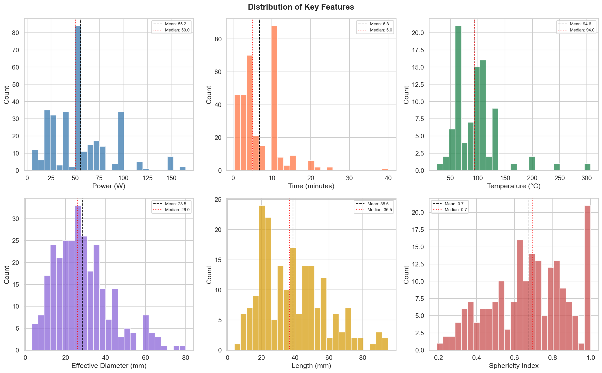
</p>

Key observations:
- **Power**: Right-skewed; majority of studies use 20–100 W, with a mean of ~48 W
- **Time**: Most treatments last 1–15 minutes, with 5 and 10 minutes most common
- **Temperature**: Available for only 29.1% of samples; ranges 25°C to 307°C
- **Effective Diameter**: Approximately normally distributed, mean ~28 mm
- **Sphericity Index**: Mean ~0.68, indicating most ablation zones are ellipsoidal

---

### Correlation Heatmap

<p align="center">
  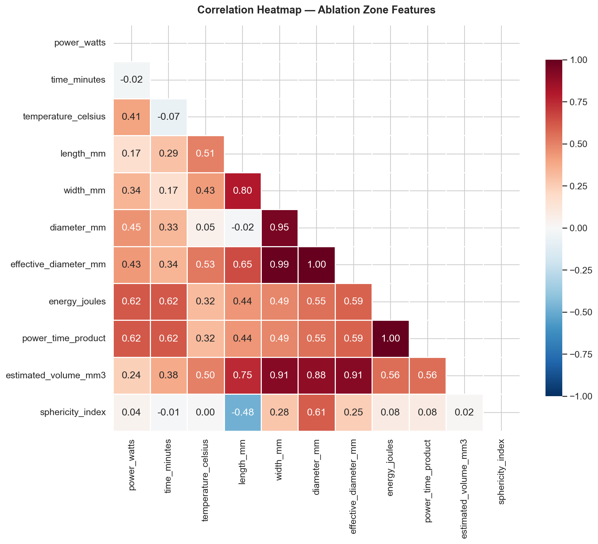
</p>

Key correlations with **effective diameter** (primary target):

| Feature | Correlation (r) |
|:---|:---:|
| `energy_joules` (power × time × 60) | +0.591 |
| `power_time_product` | +0.591 |
| `temperature_celsius` | +0.531 |
| `power_watts` | +0.430 |
| `time_minutes` | +0.343 |

> **Insight:** Energy delivered (power × time) is a significantly better predictor than either power or time alone.

---

### Ablation Zone vs. Input Parameters

<p align="center">
  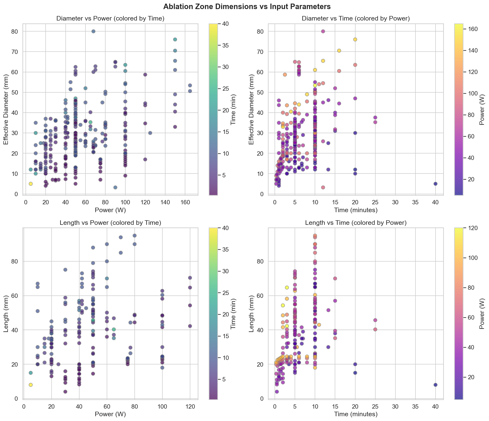
</p>

---

### Missing Value Analysis

<p align="center">
  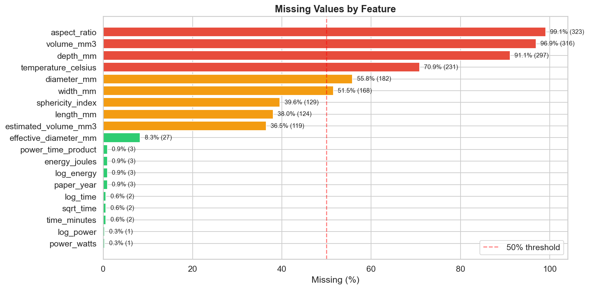
</p>

| Feature | Missing % | Status |
|:---|:---:|:---|
| `aspect_ratio` | 99.1% | Too sparse — excluded |
| `volume_mm3` | 96.9% | Too sparse — excluded |
| `temperature_celsius` | 70.9% | Optional feature |
| `length_mm` | 38.0% | Secondary target |
| `effective_diameter_mm` | 8.3% | ✅ Primary target |

---

### Antenna Type Distribution

<p align="center">
  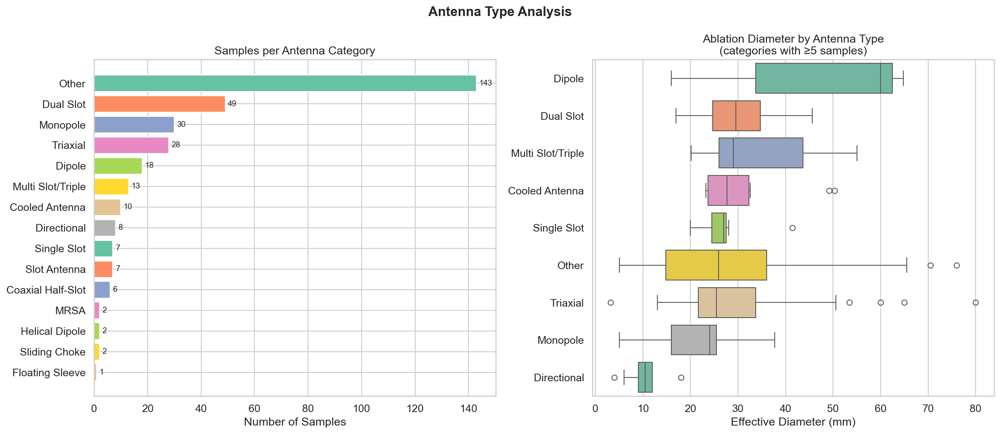
</p>

15 antenna categories identified — different antenna types produce significantly different ablation diameters, confirming antenna type as a critical input feature.

---

### Experimental vs. Simulated Data Comparison

<p align="center">
  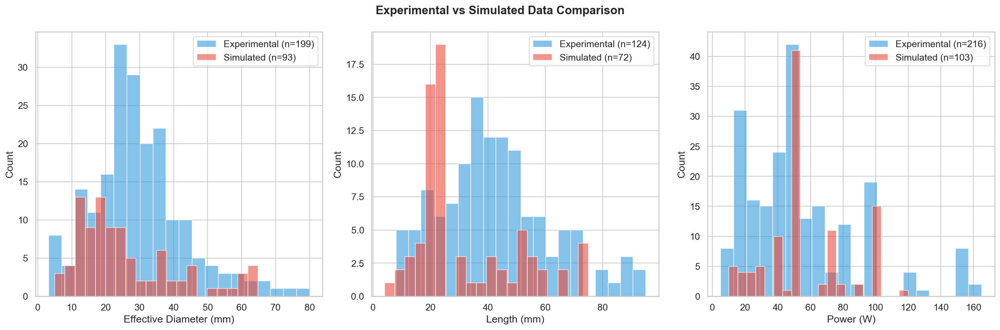
</p>

Both datasets show similar distributions, supporting their combination for training. A binary `is_simulated` flag was included to allow models to account for systematic differences.

---

## 🔧 Feature Engineering

10 features were engineered from raw treatment parameters:

| Feature | Formula / Description | Rationale |
|:---|:---|:---|
| `power_watts` | Input power in Watts | Direct parameter |
| `time_minutes` | Duration in minutes | Direct parameter |
| `energy_joules` | power × time × 60 | Heat ∝ energy deposited |
| `power_time_product` | power × time | Non-linear interaction |
| `log_power` | ln(1 + power) | Diminishing returns at high values |
| `log_time` | ln(1 + time) | Saturation effects |
| `log_energy` | ln(1 + energy) | Log-scale normalization |
| `sqrt_time` | √time | Thermal diffusion ∝ √t |
| `is_simulated` | 0 = Experimental, 1 = Simulated | Data source flag |
| `antenna_encoded` | Label-encoded (0–14) | 15 antenna categories |

---

## 🏆 Model Training & Results

Six regression models were trained with **10-fold cross-validation** and **GridSearchCV** hyperparameter optimization.

### Effective Diameter Prediction

<p align="center">
  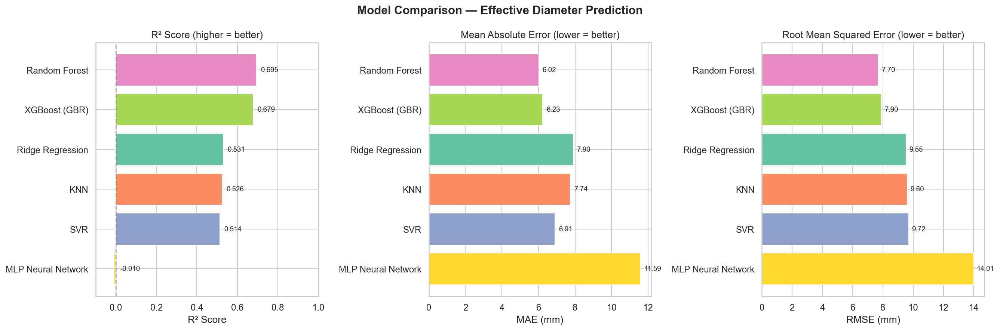
</p>

| Model | CV R² | Test R² | MAE (mm) | RMSE (mm) | MAPE (%) |
|:---|:---:|:---:|:---:|:---:|:---:|
| **🏆 Random Forest** | 0.529 | **0.695** | **6.02** | **7.70** | **26.7** |
| Gradient Boosting | 0.505 | 0.679 | 6.23 | 7.90 | 28.7 |
| Ridge Regression | 0.354 | 0.531 | 7.90 | 9.55 | 39.3 |
| KNN | 0.480 | 0.526 | 7.74 | 9.60 | 34.3 |
| SVR | 0.426 | 0.514 | 6.91 | 9.72 | 27.8 |
| MLP Neural Network | 0.454 | −0.010 | 11.59 | 14.01 | 54.2 |

### Length Prediction

<p align="center">
  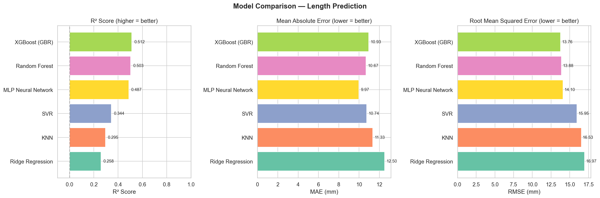
</p>

| Model | CV R² | Test R² | MAE (mm) | RMSE (mm) | MAPE (%) |
|:---|:---:|:---:|:---:|:---:|:---:|
| **🏆 Gradient Boosting** | 0.669 | **0.512** | 10.93 | **13.76** | 36.8 |
| Random Forest | 0.642 | 0.503 | 10.67 | 13.88 | 35.5 |
| MLP Neural Network | 0.512 | 0.488 | **9.97** | 14.10 | **29.5** |
| SVR | 0.618 | 0.345 | 10.74 | 15.95 | 36.8 |
| KNN | 0.601 | 0.295 | 11.33 | 16.53 | 36.1 |
| Ridge Regression | 0.399 | 0.258 | 12.50 | 16.97 | 44.4 |

---

### Predicted vs. Actual Values

<p align="center">
  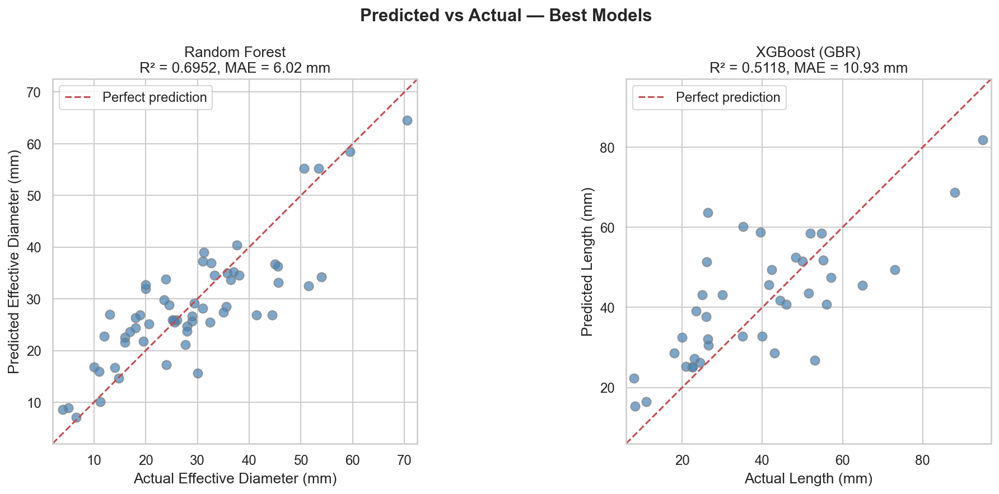
</p>

- **Diameter**: Points cluster tightly around the 45° line for 15–45 mm range
- **Length**: More variance, particularly for longer ablation zones (>50 mm)

---

### Residual Analysis

<p align="center">
  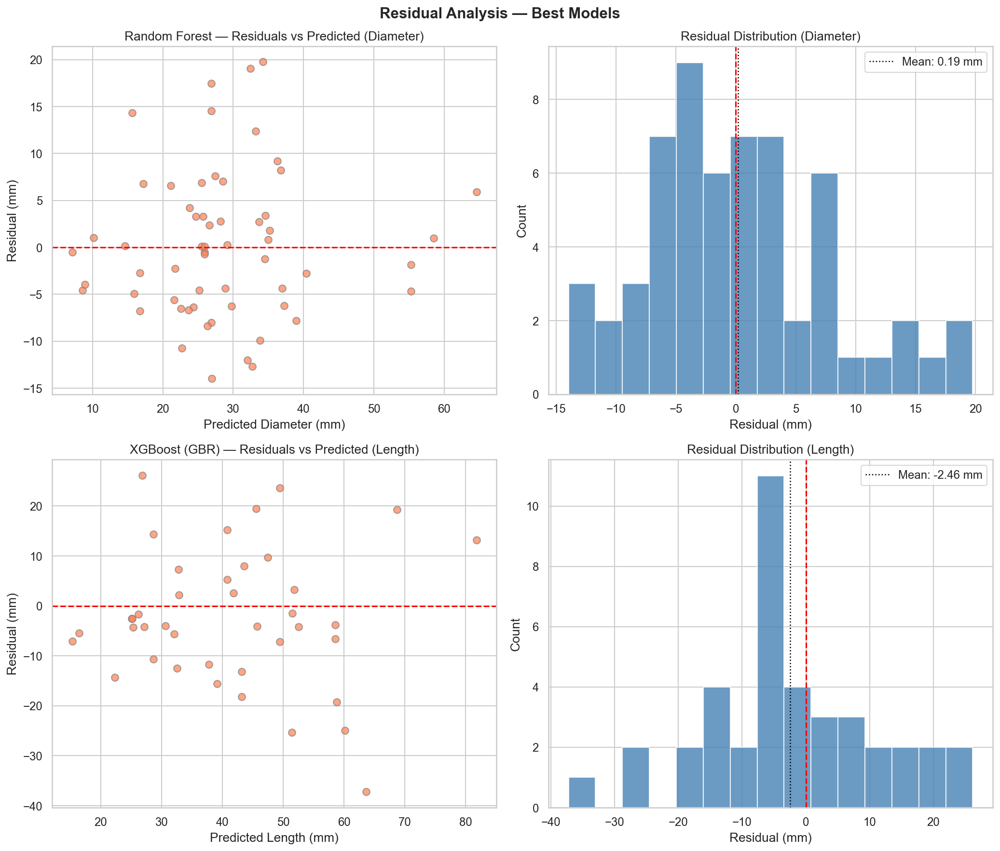
</p>

- ✅ **No systematic bias** — residuals centered around zero
- ✅ **Normal distribution** — supports regression validity  
- ⚠️ **Slight heteroscedasticity** — variance increases for larger values (expected in physical systems)

---

### Feature Importance (Random Forest — Diameter)

<p align="center">
  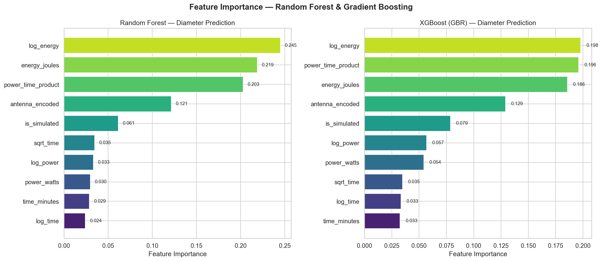
</p>

| Rank | Feature | Importance |
|:---:|:---|:---:|
| 1 | `log_energy` | 24.5% |
| 2 | `energy_joules` | 21.9% |
| 3 | `power_time_product` | 20.3% |
| 4 | `antenna_encoded` | 12.1% |
| 5 | `is_simulated` | 6.1% |

> **Key Insight:** Energy-related features collectively account for **66.7%** of prediction power, confirming total energy delivered as the dominant factor. Antenna type contributes 12.1%, playing a meaningful but secondary role.

---

### Overfitting Analysis

<p align="center">
  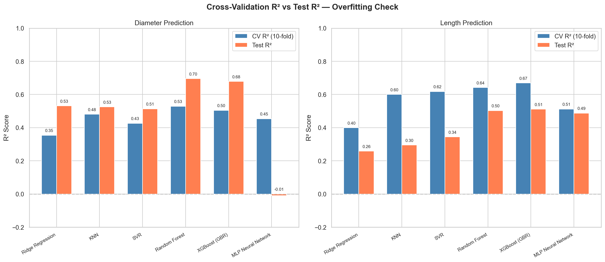
</p>

| Model | CV R² | Test R² | Verdict |
|:---|:---:|:---:|:---|
| Random Forest (Diameter) | 0.529 | 0.695 | ✅ Generalizes well |
| KNN (Length) | 0.601 | 0.295 | ⚠️ Overfitting |
| MLP (Diameter) | 0.454 | −0.010 | ❌ Severe overfitting |

**Why tree-based models win:** Tabular data + small dataset + mixed feature types + non-linear relationships = optimal conditions for Random Forest and Gradient Boosting.

---

## 🖥 Production-Ready Full-Stack Architecture

A production-grade web service designed to translate trained ML models into a practical clinical tool, built to rigorous Software Development Engineering (SDE) industry standards.

### Tech Stack & Engineering Features

| Category | Technology | Architectural Choice / Purpose |
|:---|:---|:---|
| **Frontend** | React 19 + Vite 8 | Interactive SPA with responsive, dark-mode UI for clinical environments |
| **Backend API** | FastAPI + Uvicorn | High-performance async REST API, heavily typed with Pydantic schemas |
| **Database & Cache**| PostgreSQL + Redis | Persistent relational storage via `asyncpg`/SQLAlchemy and Redis caching |
| **Deployment** | Docker & Docker Compose | Containerized multi-service architecture for flawless cross-platform deployment |
| **Resilience & Security**| SlowAPI / CORS | Multi-layered defense: strict CORS origin policies and IP-based rate-limiting |
| **Observability**| Prometheus Middlewares | Custom middlewares capturing system health, request traces, and latency metrics |

### System Highlights

- **🚥 Asynchronous Processing** — Fully non-blocking event loop on the backend using `asyncpg` and asynchronous drivers to handle multi-client inference without freezing.
- **🔴 System Monitoring** — Real-time metrics streaming at `/metrics` mapped to prometheus, logging execution time and traffic loads for scaling.
- **🔐 Robust Validation & Security** — Pydantic enforces strict input validation boundaries. Rate limiting (SlowAPI) prevents API abuse.
- **🐳 Container Orchestration** — A zero-config deployment using Docker Compose wrapping backend, frontend, database, and Redis cache tightly together.
- **🎛 Interactive UI/UX** — Modern React components gracefully handle complex clinical inputs, API fetching errors, and surface analytical data in clean KPI cards.

### Core API Endpoints

| Method | Endpoint | Description |
|:---|:---|:---|
| `GET` | `/` | API root indicating version and deployment status |
| `GET` | `/api/health` | Deep health check probing DB connection latency and model RAM status |
| `POST` | `/api/predict` | Main ML inference engine executing sub-millisecond regression predictions |
| `GET` | `/metrics` | Prometheus metrics scraping endpoint for infrastructure observability |
| `GET` | `/docs` | Pre-generated Swagger OpenAPI specifications for API consumers |

---

## 📂 Project Structure

```
HonoursReview2/
│
├── 📊 ML Pipeline
│   ├── feature_engineering.py       # Regex parsing & feature extraction
│   ├── data_preprocessing.py        # Cleaning, scaling, train/test split
│   ├── eda_analysis.py              # EDA & publication-quality plots
│   ├── model_training.py            # 6 models × GridSearchCV × 10-fold CV
│   ├── model_results.py             # Evaluation metrics & visualizations
│   └── predict_demo.py              # CLI prediction demonstration
│
├── 📈 Generated Outputs
│   ├── plots/                       # 12 publication-quality analysis plots
│   ├── preprocessed_data.pkl        # Processed data + scalers + encoders
│   └── training_results.pkl         # All trained models + metrics
│
├── 🌐 Web Application
│   └── ablation-prediction-app/
│       ├── backend/                 # FastAPI REST API
│       │   ├── main.py              # App entry, CORS, lifespan
│       │   ├── routes/              # Health check & prediction endpoints
│       │   ├── services/            # Model loader & inference engine
│       │   ├── schemas/             # Pydantic request/response schemas
│       │   ├── models/              # Serialized .pkl model files
│       │   └── requirements.txt     # Python dependencies
│       └── frontend/                # React + Vite SPA
│           ├── src/
│           │   ├── App.jsx          # Main dashboard layout
│           │   ├── components/      # PredictionForm, Results, ModelInfo
│           │   ├── services/        # API client
│           │   └── utils/           # Formatters & helpers
│           └── package.json         # Node.js dependencies
│
├── 📝 Academic Report (LaTeX)
│   ├── report.tex                   # Main document
│   ├── chapter1_filled.tex          # Introduction
│   ├── chapter2_filled.tex          # Literature Review
│   ├── chapter3_filled.tex          # Dataset & EDA
│   ├── chapter4_filled.tex          # Methodology
│   ├── chapter5_filled.tex          # Results & Discussion
│   ├── chapter6_filled.tex          # Clinical Dashboard
│   ├── chapter7_filled.tex          # Conclusion & Future Work
│   └── references.bib              # Bibliography
│
├── 📄 Data Files
│   ├── Ablation Zone Model - Experimental data.csv
│   ├── Ablation Zone Model2 - Simulated data.csv
│   ├── combined_data_engineered.csv
│   ├── combined_data_ml_ready.csv
│   ├── experimental_data_engineered.csv
│   └── simulated_data_engineered.csv
│
└── README.md                        # ← You are here
```

---

## 🚀 Getting Started

### Prerequisites

- **Python 3.8+** with pip
- **Node.js 18+** with npm
- Git

### 1️⃣ Clone the Repository

```bash
git clone https://github.com/Rs21122004/AblationPredictor.git
cd AblationPredictor
```

### 2️⃣ Run the ML Pipeline (Optional — models are pre-trained)

```bash
# Install ML dependencies
pip install pandas numpy scikit-learn matplotlib seaborn

# Step 1: Feature Engineering
python feature_engineering.py

# Step 2: Data Preprocessing
python data_preprocessing.py

# Step 3: Train All Models (takes ~2-5 minutes)
python model_training.py

# Step 4: Generate Result Plots
python model_results.py

# Step 5: Quick CLI Prediction Demo
python predict_demo.py
```

### 3️⃣ Launch the Web Application

**Start the Backend API:**

```bash
cd ablation-prediction-app/backend
pip install -r requirements.txt
uvicorn main:app --reload --port 8000
```

The API will be available at `http://localhost:8000` with Swagger docs at `/docs`.

**Start the Frontend Dashboard:**

```bash
cd ablation-prediction-app/frontend
npm install
npm run dev
```

The dashboard will be available at `http://localhost:5173`.

---

## 🧪 Sample Predictions

| Power (W) | Time (min) | Antenna | Pred. Diameter (mm) | Pred. Length (mm) | Est. Volume (mm³) |
|:---:|:---:|:---|:---:|:---:|:---:|
| 50 | 5 | Dual Slot | ~27 | ~38 | ~14,500 |
| 50 | 10 | Dual Slot | ~33 | ~47 | ~26,800 |
| 100 | 5 | Monopole | ~35 | ~50 | ~32,000 |
| 100 | 10 | Monopole | ~42 | ~58 | ~53,500 |
| 20 | 5 | Dipole | ~20 | ~30 | ~6,300 |
| 80 | 10 | Triaxial | ~38 | ~45 | ~34,000 |

---

## ⚠️ Limitations & Future Work

### Current Limitations

| # | Limitation | Impact |
|:---:|:---|:---|
| 1 | **Dataset size** (326 samples) | Small for ML; more data would improve generalization |
| 2 | **Missing antenna params** | Antenna length, slot dimensions, frequency not available |
| 3 | **Tissue variability** | Combines liver, lung, kidney, egg white, bovine without encoding |
| 4 | **Temperature data** | Only 29.1% coverage — cannot use as reliable feature |
| 5 | **Heterogeneous sources** | Aggregated papers may have measurement biases |

### Future Work

- 📚 **Expand the dataset** with more recent publications and additional modalities
- 🧬 **Tissue-specific features** (perfusion rate, dielectric properties, tissue type)
- 🧠 **Deep learning** with larger datasets (physics-informed neural networks)
- 🌐 **3D ablation shape prediction** using image-based ML models
- 📱 **Deployed web tool** with authentication and patient-level tracking
- 🎯 **Multi-output models** that simultaneously predict diameter, length, and volume

---

## 📚 Academic Context

This repository contains the complete codebase and LaTeX source for an **Honours Project submission** at IIIT Kottayam. The thesis covers:

| Chapter | Topic |
|:---|:---|
| Chapter 1 | Introduction & Problem Statement |
| Chapter 2 | Literature Review — MWA & ML in Medicine |
| Chapter 3 | Dataset Description & Exploratory Data Analysis |
| Chapter 4 | Methodology — Preprocessing, Models, Metrics |
| Chapter 5 | Results & Discussion — Model Comparison |
| Chapter 6 | Clinical Decision Support Dashboard |
| Chapter 7 | Conclusion & Future Work |

The compiled report is available as [`Honours_Project_Report.pdf`](Honours_Project_Report.pdf).

---

## 🛠 Tech Stack Summary

```
Infrastructure:      Docker · Docker Compose · Redis · PostgreSQL
Backend Engine:      FastAPI · Uvicorn · asyncpg · SQLAlchemy · Alembic
ML Pipeline:         Python · scikit-learn · Pandas · NumPy · GridSearchCV
Observability:       Prometheus · Request Middlewares · SlowAPI (Rate Limiting)
Frontend UI:         React 19 · Vite 8 · Vanilla CSS (dark theme)
Report:              LaTeX · BibTeX
```

---

<p align="center">
  <sub>Built with ❤️ as part of an Honours Research Project at IIIT Kottayam</sub>
  <br/>
  <sub>Microwave Ablation Zone Prediction using Machine Learning · April 2026</sub>
</p>
